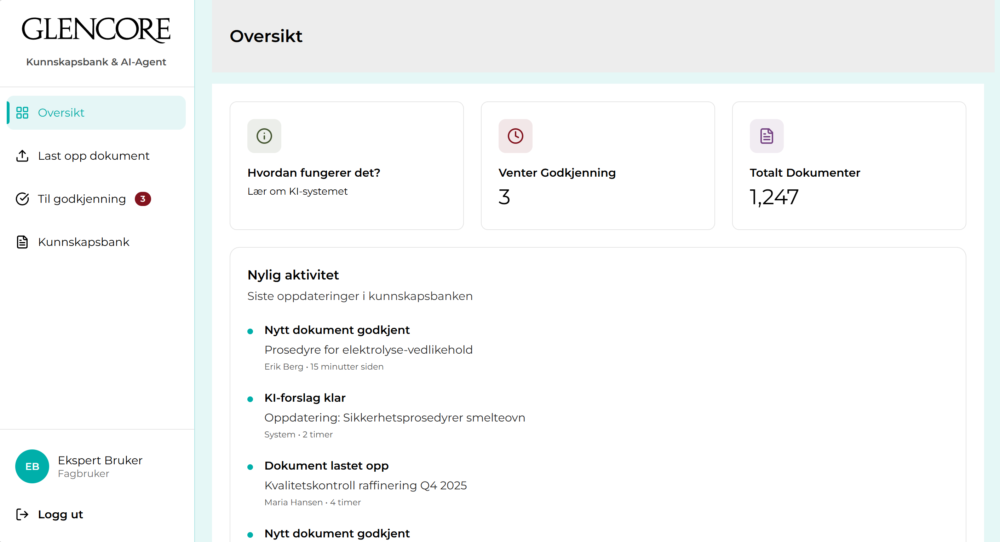

# Glencore Knowledge Base - Kunnskapsbank & KI-agent



Intelligent knowledge management system for Glencore Nikkelverk AS.

## Technologies Used

- **React 18.3.1** - UI Library
- **TypeScript** - Programming Language
- **React Router 7** - Routing Management
- **Tailwind CSS 4** - Styling Framework
- **Lucide React** - Icon Library
- **Vite** - Build Tool

## Brand Identity

### Colors
- **Primary (Teal):** `#00AFAA`
- **Light Background:** `#E6F7F7` or `#00afaa1a`
- **Header Background:** `#ededed`
- **Red (Alerts/Reject):** `#82131E`

### Typography
- **Font:** Montserrat
- **Weights:**
  - Light (300)
  - Regular (400)
  - SemiBold (600)

## Project Structure

```
src/
├── app/
│   ├── components/
│   │   ├── sidebar.tsx          # Navigation sidebar
│   │   └── error-boundary.tsx   # Error handling
│   ├── context/
│   │   ├── auth-context.tsx     # Authentication state
│   │   └── documents-context.tsx # Document management
│   ├── pages/
│   │   ├── login-page.tsx       # Login page
│   │   ├── dashboard-page.tsx   # Overview dashboard
│   │   ├── upload-page.tsx      # Document upload
│   │   ├── queue-page.tsx       # Review queue
│   │   ├── knowledge-bank-page.tsx  # Knowledge bank
│   │   └── document-detail-page.tsx # Document details
│   ├── routes.ts                # Router configuration
│   └── App.tsx                  # Root application
└── styles/
    ├── fonts.css                # Font imports
    ├── theme.css                # Design tokens
    ├── tailwind.css             # Tailwind configuration
    └── index.css                # Main styles
```

## Pages

1. **Login** (`/`) - Authentication portal
2. **Dashboard** (`/dashboard`) - System overview
3. **Upload** (`/upload`) - New document ingestion
4. **Queue** (`/queue`) - Review and approval workflow
5. **Knowledge Bank** (`/knowledge-bank`) - Browsing approved documents
6. **Document Detail** (`/document/:id`) - Full document visualization

## Installation & Running

```bash
# Install dependencies
npm install

# Start development server
npm run dev

# Build for production
npm run build
```

Then open the browser at:
http://localhost:5191/

## Features

✅ User Authentication System  
✅ Document Upload & Classification  
✅ Approval & Review Workflow  
✅ Knowledge Bank with Search & Filtering  
✅ Detailed Document Previews  
✅ Official Glencore Branded UI  

## Attributions

See `ATTRIBUTIONS.md` for third-party libraries, fonts, and assets used in this project.

## License

This project is licensed under the MIT License.
© 2026 Raghad Alhalabi

---

**Date:** March 2026  
**Version:** 1.1.0